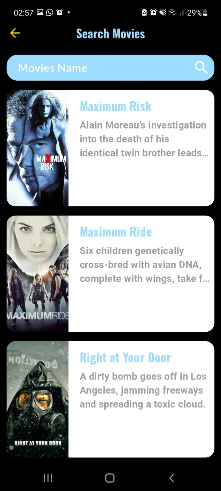

# 🎬 Flutter Movie App

A Flutter application to explore movies using the [TMDB API](https://www.themoviedb.org/).  
The app provides a clean and modern UI to browse movies, view details, and search easily.

---

## 📸 Screenshots

### 🏠 Movie Screen


### ⭐ Top Rated


### 🎞️ Movie Details


### 🔎 Search



## ✨ Features

- 📺 Display **Now Playing** movies (currently in theaters).
- 🔥 Show **Trending** movies.
- ⭐ Browse **Top Rated** movies.
- 📝 View detailed information about each movie (title, overview, rating, release date).
- 🔎 Search movies by name.
- ⚡ Built with **Flutter BLoC** and **Clean Architecture** for scalability and maintainability.

---

## 📦 Packages Used

- [equatable](https://pub.dev/packages/equatable) – for easy object comparison.
- [dio](https://pub.dev/packages/dio) – for handling API requests.
- [dartz](https://pub.dev/packages/dartz) – for functional programming (Either/Failure).
- [get_it](https://pub.dev/packages/get_it) – dependency injection.
- [flutter_bloc](https://pub.dev/packages/flutter_bloc) – state management with BLoC.
- [cached_network_image](https://pub.dev/packages/cached_network_image) – for displaying cached images.
- [google_fonts](https://pub.dev/packages/google_fonts) – use Google Fonts easily.
- [flutter_cache_manager](https://pub.dev/packages/flutter_cache_manager) – cache management.

---

## 🚀 Installation

1. **Clone the repo**

   ```bash
   git clone https://github.com/mohamadayash22/flutter-movie-app.git
   cd flutter-movie-app
   ```

2. **Add your API key into api_constants file**
   ```bash
   apiKey = 'YOUR_API_KEY';
   ```
